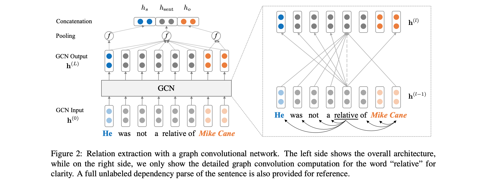

Graph Convolution over Pruned Dependency Trees for Relation Extraction
==========

This repo contains the *PyTorch* code for the paper [Graph Convolution over Pruned Dependency Trees Improves Relation Extraction](https://nlp.stanford.edu/pubs/zhang2018graph.pdf). 

This paper/code introduces a graph convolutional neural network (GCN) over pruned dependency trees for the task of relation extraction. A special tree pruning technique called the Path-centric Pruning is also introduced to eliminate irrelevant information from the trees while maximally maintaining relevant information. Compared to sequence models such as various LSTM-based models, this GCN model makes use of dependency structures to bridge remote words, therefore improves performance for long-range relations. Compared to previous recursive models such as the TreeLSTM, this GCN model achieves better performance while being much eariser to parallelize and therefore much more efficient.

See below for an overview of the model architecture:



## Requirements

- Python 3 (tested on 3.6.5)
- PyTorch (tested on 0.4.0)
- tqdm
- unzip, wget (for downloading only)

## Preparation

The code requires that you have access to the TACRED dataset (LDC license required). The TACRED dataset is currently scheduled for public release via LDC in December 2018. For possible early access to this data please contact us at `yuhao.zhang ~at~ stanford.edu`. Once you have the TACRED data, please put the JSON files under the directory `dataset/tacred`. For completeness, we only include sample data files from the TACRED dataset in this repo.

First, download and unzip GloVe vectors from the Stanford NLP group website, with:
```
chmod +x download.sh; ./download.sh
```

Then prepare vocabulary and initial word vectors with:
```
python prepare_vocab.py dataset/tacred dataset/vocab --glove_dir dataset/glove
```

This will write vocabulary and word vectors as a numpy matrix into the dir `dataset/vocab`.

## Training

To train a graph convolutional neural network (GCN) model, run:
```
bash train_gcn.sh 0
```

Model checkpoints and logs will be saved to `./saved_models/00`.

To train a Contextualized GCN (C-GCN) model, run:
```
bash train_cgcn.sh 1
```

Model checkpoints and logs will be saved to `./saved_models/01`.

For details on the use of other parameters, such as the pruning distance k, please refer to `train.py`.

## Evaluation

To run evaluation on the test set, run:
```
python eval.py saved_models/00 --dataset test
```

This will use the `best_model.pt` file by default. Use `--model checkpoint_epoch_10.pt` to specify a model checkpoint file.

## Retrain

Reload a pretrained model and finetune it, run:
```
python train.py --load --model_file saved_models/01/best_model.pt --optim sgd --lr 0.001
```

## Related Repo

The paper also includes comparisons to the position-aware attention LSTM (PA-LSTM) model for relation extraction. To reproduce the corresponding results, please refer to [this repo](https://github.com/yuhaozhang/tacred-relation).

## Citation

```
@inproceedings{zhang2018graph,
 author = {Zhang, Yuhao and Qi, Peng and Manning, Christopher D.},
 booktitle = {Empirical Methods in Natural Language Processing (EMNLP)},
 title = {Graph Convolution over Pruned Dependency Trees Improves Relation Extraction},
 url = {https://nlp.stanford.edu/pubs/zhang2018graph.pdf},
 year = {2018}
}
```

## License

All work contained in this package is licensed under the Apache License, Version 2.0. See the included LICENSE file.
